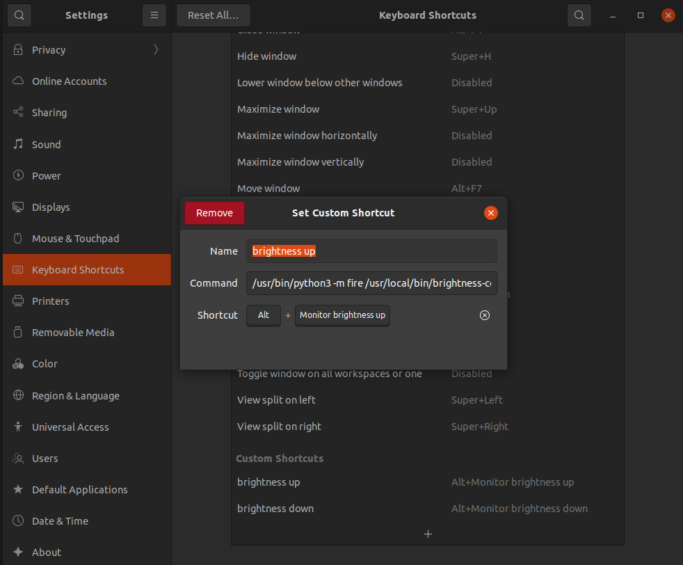

用于解决ubuntu 亮度无法调节情况，在前人基础上优化了一下，自适应获取当前屏幕
# 使用方法

1. ./install
2. 加入快捷键
   
   **brightness up**:`/usr/bin/python3 -m fire /usr/local/bin/brightness-control/offline.py up`
   **brightness down**:`/usr/bin/python3 -m fire /usr/local/bin/brightness-control/offline.py down`
   这里设置的是在键盘调节亮度的按键前加入alt